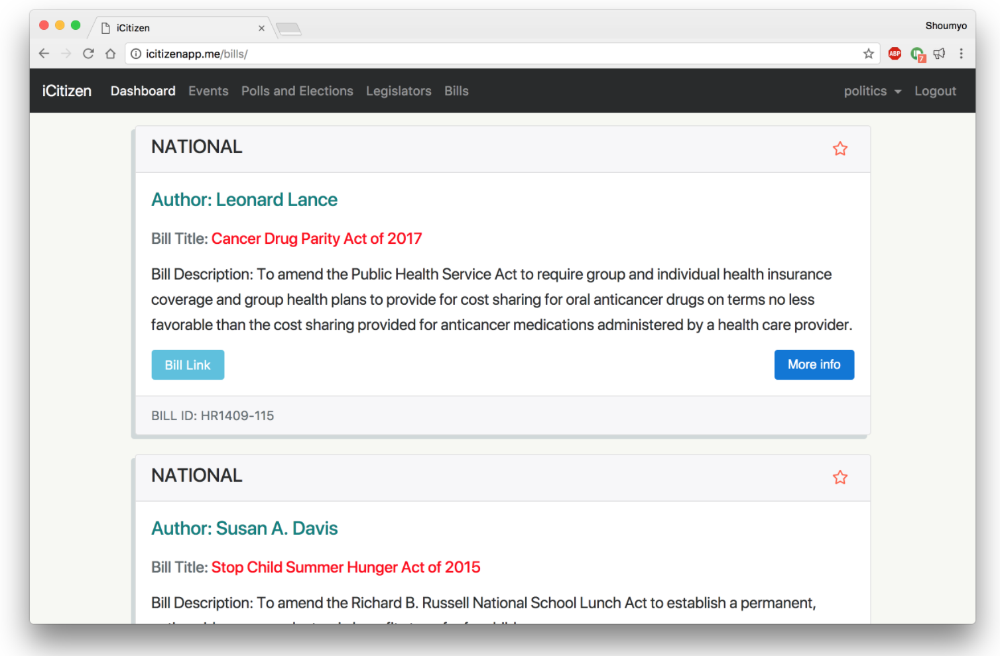
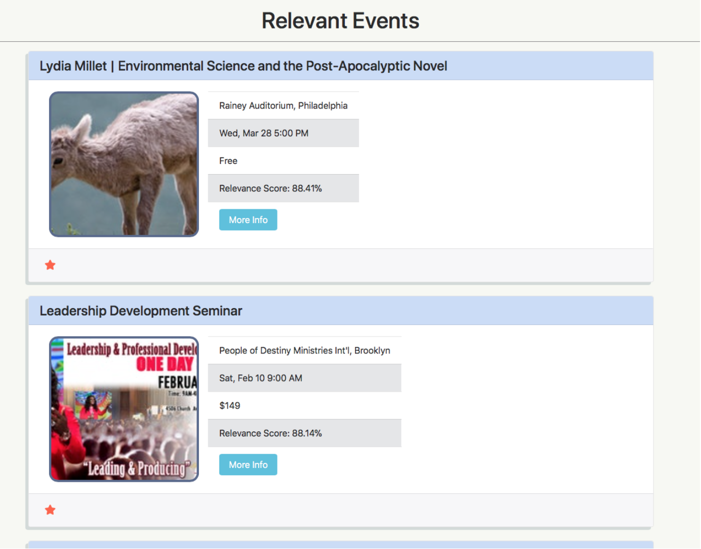

# iCitizenFlask
[icitizenapp.me](http://icitizenapp.me)

A political information website made to give users more relevant political data and help them get more involved in politics. Built using Python, Flask, Celery, MongoDB, jQuery/AJAX, Bootstrap4, and a number of APIs: OpenStates, ProPublica, Google Civic Information.

## Motivation
This group project was completed over the course of the winter break of 2017-2018. We completed this project mainly to learn more about development, specifically web development. In the end, we came out with a stronger understanding of some of the core technologies used in this project, including: Python, Flask, MongoDB, Celery, Javascript/jQuery/AJAX, Bootstrap, RESTful APIs, and HTTP Requests. The goal of this project was to create a platform for making political data easily accessible.

## About the Project
The iCitizen app attempts to give users a more focused and practical view of politics by sorting and ranking the various political events and bills according to their interests and according to who their legislators are. It also displays the user’s legislators and upcoming polls that the user may want to get involved in. The website provides functionality for users to save information that they are interested in, allowing them to easily revisit it in the future (deleting saved data is just as easy if a user changes their mind).

Users then have the option of saving specific items to view them at a later time and they also have the option to update their preferences at any time to receive new bills and events they may be interested in.

There are two inputs asked of every user who uses the app: Location and Topics of Interest. From there, a list of bills and events is ranked and sorted to how relevant they are for the user, depending on the user’s chosen preferences. 

Bills are pulled based on legislator and preferred subjects. A number of factors are taken into account when ranking bills: including the number of cosponsors, the sponsor of the bill, and when the bill was last acted upon. From these rankings, the ten most relevant bills are returned to the user. All national bills are pulled from ProPublica while all state bills are pulled from OpenStates.

Events are ranked on a similar methodology where they are scanned for words relating to the inputted subjects and then ranked based on their location and relevancy to the user. All events are scraped from EventBrite, a popular organizing tool for political events.

All polls are pulled using the Google Civic Information API with the user’s inputted address, allowing the polls to be unique for the user. All legislators are pulled using both OpenStates and ProPublica.

## Technologies

### Python and Flask
All server-side code for this project was written in Python. We used the Flask microframework for creating routes and serving up individual pages, as well as handling POST requests where users could input information. Using Python made certain tasks easier, such as making requests to the API endpoints we used, as well as using the nltk library for sorting relevant events. Using Flask and the WTForms library, we handled a local strategy of user registration and login. User passwords are hashed using the SHA256 module within Passlib for extra security. 

Flask routes in this application are separated based on the type of information the user is trying to access or modify. In this way, routes are separated into files in the following manner: user_routes (routes for registration, login, etc.); user_functions (updating preferences, showing user profile, saving and deleting saved data); user_data (for fetching data from API endpoints –– these methods are not accessed by the user); and finally get_saved_data (for fetching a user’s saved polls/events/bills/legislators).

### MongoDB

We used MongoDB as our primary database for this project due to its simplicity in storing JSON-like documents and the straightforward Pymongo driver. Our database has a single collection for storing users and the information related to them. Within user objects, we store some basic information such as username, password, location, and topics of interest to the user. Pulling this data when the user logs in, we fetch political data and sort it by relevance for the specific user. This fetched data is temporarily stored in the database while the user is logged in so that multiple requests to the same page (say, the dashboard) does not initiate redundant requests to the APIs we used. This data is cleared out once the user logs out, although the user’s saved data remains stored in the user object. 

### Celery
Celery is an asynchronous task manager that we paired with Flask to deal with the massive amounts of data we needed to write to MongoDB. Celery uses workers to queue tasks received by the application and asynchronously execute them even as the application continues to function. Currently, on our server we run two separate celery workers with Redis as a broker that help write the user’s legislators, bills, events, and polls to MongoDB. Celery allows us to maintain functionality of our website even as massive server side operations are ongoing because celery does not deal with our application other than to receive commands. The two celery workers also allow us to save time in general when writing to the database by allowing us to write bills and events simultaneously to MongoDB, instead of one task after another. The celery workers run independently on the server and are not executed as part of the application.

### Javascript/jQuery/AJAX

Because of the massive amounts of data we were writing to the database, dynamically updating the HTML was necessary to display data as it came in without refreshing the page. To do this we made use of JQuery and AJAX. We used AJAX calls to poll the DB periodically and check whether our required data was there or not. Once that data was found, we utilized JQuery to dynamically update the HTML with our content. We also utilized AJAX to help the user save/unsave specific items by watching for their clicks and writing/deleting specific items from the database.

### Bootstrap

Twitter’s Bootstrap framework simplified the UI design and implementation process, allowing our website to have a clean look and feel. We used some of the basic Bootstrap components, such as navbars, carousels, jumbotrons, dropdowns, and cards to display information in a logical manner. Due to time constraints, we were not able to fully utilized the responsiveness to screen size that can be achieved with Bootstrap, so the website is mostly tailored for users accessing the site using a laptop/desktop.

### Hosting
The website is hosted on a DigitalOcean droplet and is served using uWSGI and Nginx. MongoDB and Redis are run locally, as are the Celery workers.

## Contributors

Made by Pranay Neelagiri, Shoumyo Chakravorti, and Atharva Kench.

